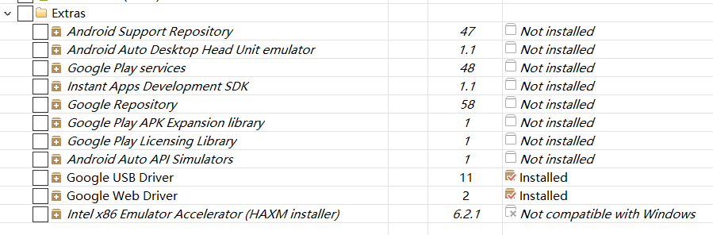

概念
===
SDK：（software development kit）软件开发工具包。被软件开发工程师用于为特定的软件包、软件框架、硬件平台、操作系统等建立应用软件的开发工具的集合。
因此，Android SDK 指的是Android专属的软件开发工具包。<br>

## 下载安装

首先需要安装配置好jdk环境。<br>

### Android SDK包下载
•	官网下载：https://android-sdk.en.softonic.com/download<br>
•	网盘下载： http://tools.android-studio.org/index.php/sdk<br>
下载对应的安装包后，点击安装即可。<br>
### Android SDK Manager
安装后启动 SDK Manager.exe 程序就可以看到Android SDK Mannerger的主界面。<br>

<br>
### Tools目录
<br>
Android SDK Tools（必须，只需下载一个版本，一般选最新版本）：基础工具包，版本号带rc字样的是预览版。<br>
Android SDK Platform-tools（必须，只需下载一个版本，一般选最新版本）：从android2.3开始划出此目录，存放公用开发工具，比如adb、sqlite3等，被划分到了这里。<br>
Android SDK Build-tools（必须，可以安装多个版本）：Android项目构建工具。<br>
### Android xxx（API xx） 目录（可选的各平台开发工具）
<br>
•	Documentation for AndroidSdk（可选）：安卓开发者官网的一些离线文档，不过下载下来打开也很慢，后面会提供另外一个离线版。<br>
•	**SDK Platform**（必须）：对应平台的开发工具，需要在哪个版本的平台下开发就下载哪个。<br>
•	Samples for SDK（可选，此项在高版本tools中已不提供，需要在IDE里通过Import Sample引入，当然也可以下载离线版）：内置的安卓示例程序，推荐安装。<br>
•	Sources for Android SDK（可选）：安卓API的源代码，推荐安装。<br>
•	ARM /Intel xxxx Image（可选）：各个以Image结尾的东西是支持相应平台的模拟器，我们就把它想象成一个刷机包吧。（使用真机调试或使用其它模拟器的话不需要安装）<br>
### Extras目录（可选的扩展）
<br>
•	Android Support Repository（可选）：主要是方便在gradle中使用Android Support Libraries，因为Google并没有把这些库发布到maven center或者jcenter去，而是使用了Google自己的maven仓库。<br>
•	Intel x86 Emulator Accelerator(HAXM installer)（可选）：windows平台的Intel x86模拟器加速工具，配合Intel x86 atom/atom_64 System Image使用可加快模拟器的运行速度。<br>
•
Tips：如果觉得一个个安装下载太麻烦，可以直接在视频下方【获取素材】获取已经下载打包好的Android_SDK压缩包：Andriod_SDK.zip，立等可取，开箱即用！<br>
## Android SDK文件目录

**add-ons**<br>
这里面保存着附加库，第三方公司为android 平台开发的附加功能系统。比如GoogleMaps，当然你如果安装了OphoneSDK，这里也会有一些类库在里面。<br>
**docs**<br>
这里面是Android SDKAPI参考文档，所有的API都可以在这里查到。<br>
**extras**<br>
该文件夹下存放了Android support v4，v7，v13，v17包； 还有google提供额USB驱动、Intel提供的硬件加速等附加工具包， 和market_licensing作为AndroidMarket版权保护组件，一般发布付费应用到电子市场可以用它来反盗版。<br>
**platforms**<br>
是每个平台的SDK真正的文件，存放了不同版本的android系统。里面会根据APILevel划分的SDK版本。<br>
**samples**<br>
是Android SDK自带的默认示例工程，里面的apidemos强烈推荐初学者运行学 习，对于SQLite数据库操作可以查看NotePad这个例子，对于游戏开发Snake、LunarLander都是不错的例子，对于Android主 题开发Home则是androidm5时代的主题设计原理。<br>
## 环境变量设置
•	系统变量里面添加变量名 ANDROID_HOME 路径为实际存放SDk的路径
<br>
•	其他几个路径配置到系统环境Path中如下图所示：<br>
<br>
## 配置检测
在cmd界面输入“adb” 和"appt"来判断安装是否成功。<br>
**adb命令**<br>
```在cmd界面输入
C:\Users\CaptainJi>adb<br>
Android Debug Bridge version 1.0.39
Revision 3db08f2c6889-android
Installed as E:\Andriod_sdk\platform-tools\adb.exe

global options:
 -a         listen on all network interfaces, not just localhost
 -d         use USB device (error if multiple devices connected)
 -e         use TCP/IP device (error if multiple TCP/IP devices available)
 -s SERIAL
     use device with given serial number (overrides $ANDROID_SERIAL)
 -p PRODUCT
     name or path ('angler'/'out/target/product/angler');
     default $ANDROID_PRODUCT_OUT
 -H         name of adb server host [default=localhost]
 -P         port of adb server [default=5037]
 -L SOCKET  listen on given socket for adb server [default=tcp:localhost:5037]<br>
```

**aapt**命令<br>
```在cmd界面输入
C:\Users\CaptainJi>aapt
Android Asset Packaging Tool

Usage:
 aapt l[ist] [-v] [-a] file.{zip,jar,apk}
   List contents of Zip-compatible archive.

 aapt d[ump] [--values] [--include-meta-data] WHAT file.{apk} [asset [asset ...]]
   strings          Print the contents of the resource table string pool in the APK.
   badging          Print the label and icon for the app declared in APK.
   permissions      Print the permissions from the APK.
   resources        Print the resource table from the APK.
   configurations   Print the configurations in the APK.
   xmltree          Print the compiled xmls in the given assets.
   xmlstrings       Print the strings of the given compiled xml assets.
```
