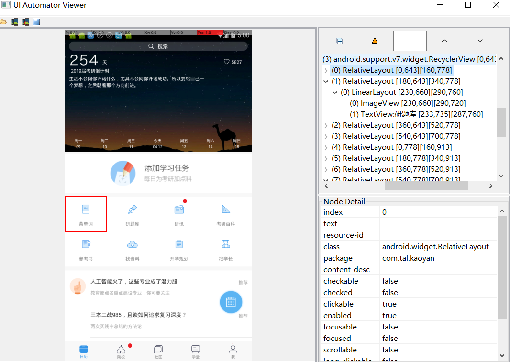

uiautomator
==
## 简介
Android 4.3发布的时候包含了一种新的测试工具–uiautomator，uiautomator是用来做UI测试的。也就是普通的手工测试，点击每个控件元素 看看输出的结果是否符合预期。比如 登陆界面 分别输入正确和错误的用户名密码然后点击登陆按钮看看是否能否登陆以及是否有错误提示等。 
**官方介绍如下：** 
UI Automator is a UI testing framework suitable for cross-app functional UI testing across system and installed apps. 
Note: This framework requires Android 4.3 (API level 18) or higher. 
UI Automator是一个UI测试框架，适用于跨系统和已安装应用程序的跨应用程序功能性UI测试。 
注意：它需要Android 4.3 (API level 18)以上版本 

## 相关工具
Android SDK在4.3中提供了如下工具来支持UI自动化测试： 
•	uiautomatorviewer – 一个图形界面工具来扫描和分析应用的UI控件。存放在tools目录 
•	uiautomator – 一个测试的Java库，包含了创建UI测试的各种API和执行自动化测试的引擎。 
要使用该工具，需要满足如下条件： 
•	Android SDK Tools, Revision 21 or higher 
•	Android SDK Platform, API 18 or higher 
## 使用方法
1.	开启真机（或模拟器）的USB调式模式后连接电脑 
2.	打开设备上的App界面 
3.	启动UI Automatorviewer 
4.	获取对应页面的元素(多设备连接时要选择需要获取元素的设备) 
## 注意事项
### 报错1
Error while parsing UI hierarchy XML file: Invalid ui automator hierarchy file.  
一般Andriod 4.X系统会容易出现，换5.X及以上的系统OK 
### 报错2
java.lang.ArrayIndexOutOfBoundsException 
【解答】一般是设备息屏，导致页面没有元素显示，获取时数组地址越界报错，激活设备重启UI Auto即可 
•	演示获取真机模拟器的界面 
•	获取报错的笔记 
### 报错3
Error while obtaining UI hierarchy XML file: com.android.ddmlib.SyncException: Remote object doesn't exist! 

这个错的原因是因为没有dump下来界面的信息保存到uidump.xml文件中，而该文件保存在/data/local/tmp下，如果没生成该文件，uiautomatorviewer就会报这个错。 
解决方案为：重启设备或者重新连接 
