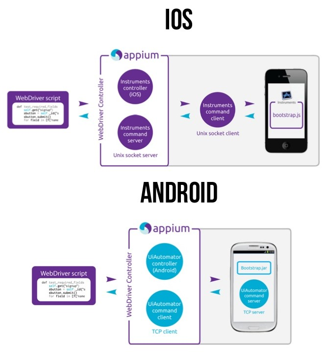
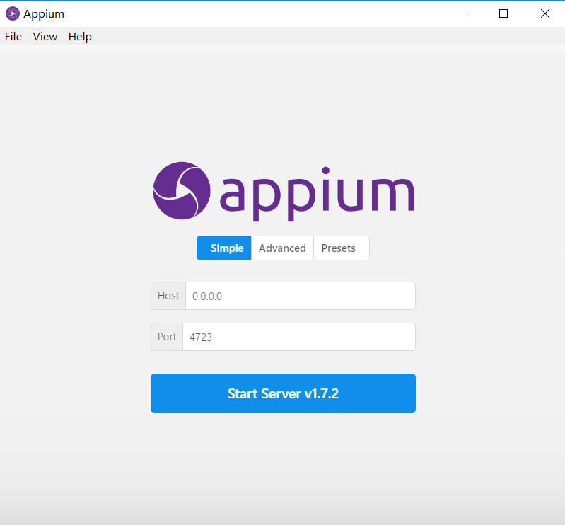
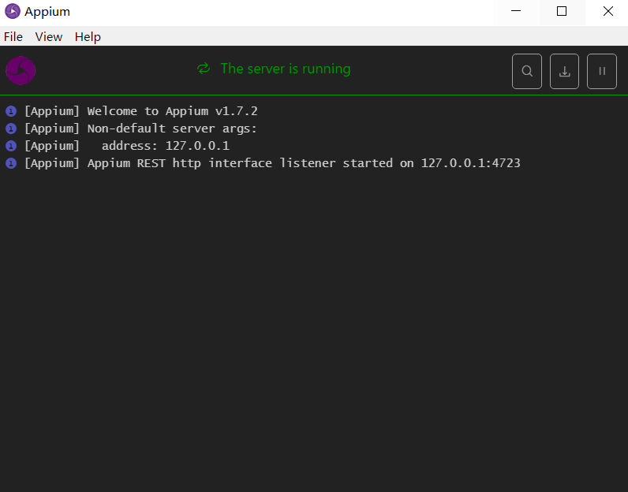
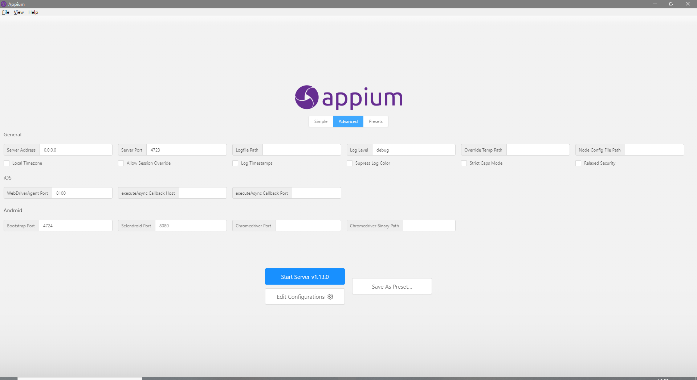

Appium简介
==
Appium is an open source test automation framework for use with native, hybrid and mobile web apps. It drives iOS, Android, and Windows apps using the WebDriver protocol.<br>
Appium是一个开源测试自动化框架，可用于原生，混合和移动Web应用程序测试。 它使用WebDriver协议驱动iOS，Android和Windows应用程序。<br>
•	[Appium官网](http://appium.io)<br>
•	[Appium github主页](https://github.com/appium?utf8=%E2%9C%93&q=&type=source&language=)<br>
•	[官方中文文档](http://appium.io/docs/cn/about-appium/intro/)<br>
•	[Appium官方论坛](http://discuss.appium.io/latest)<br>
•	[Testerhome中文社区](https://testerhome.com/)<br>
## Appium优势
•	可以跨平台同时支持android、ios<br>
•	支持多种语言，java、python、php、Ruby等等<br>
•	不用为复杂的环境发愁<br>
•	如果你有selenium经验，直接上手。<br>

## Appium架构原理
Appium是在手机操作系统自带的测试框架基础上实现的，Android和iOS的系统上使用的工具分别如下：<br>
•	Android（版本>4.3）：UIAutomator，Android 4.3之后系统自带的UI自动化测试工具。<br>
•	Android（版本≤4.3）：Selendroid，基于Android Instrumentation框架实现的自动化测试工具。<br>
•	·iOS：UIAutomation（instruments框架里面的一个模板），iOS系统自带的UI自动化测试工具。<br>

### 运行原理

我们的电脑（client）上运行自动化测试脚本，调用的是webdriver的接口，appium server接收到我们client上发送过来的命令后他会将这些命令转换为UIautomator认识的命令，然后由UIautomator来在设备上执行自动化。<br>
Appium的架构原理如上图所示，由客户端（Appium Client）和服务器（Appium Server）两部分组成，客户端与服务器端通过JSON Wire Protocol进行通信。<br>
### Appium服务器
Appium服务器是Appium框架的核心。它是一个基于Node.js实现的HTTP服务器。Appium服务器的主要功能是接受从Appium客户端发起的连接，监听从客户端发送来的命令，将命令发送给bootstrap.jar（iOS手机为bootstrap.js）执行，并将命令的执行结果通过HTTP应答反馈给Appium客户端。<br>
### Bootstrap.jar
Bootstrap.jar是在Android手机上运行的一个应用程序，它在手机上扮演TCP服务器的角色。当Appium服务器需要运行命令时，Appium服务器会与Bootstrap.jar建立TCP通信，并把命令发送给Bootstrap.jar；Bootstrap.jar负责运行测试命令。<br>
### Appium客户端
它主要是指实现了Appium功能的WebDriver协议的客户端Library，它负责与Appium服务器建立连接，并将测试脚本的指令发送到Appium服务器。现有的客户端Library有多种语言的实现，包括Ruby、Python、Java、JavaScript（Node.js）、Object C、PHP和C#。Appium的测试是在这些Library的基础上进行开发的。<br>
## Appium组件
### Appium Server
Appium Server就是Appium的服务端——一个web接口服务，使用Node.js实现。引用官网解释说明。<br>
Appium is a server written in Node.js. It can be built and installed from source or installed directly from NPM:<br>
```NPM
$ npm install -g appium
$ appium
```
### Appium Desktop
Appium Desktop是一款适用于Mac，Windows和Linux的开源应用程序，它以美观而灵活的用户界面为您提供Appium自动化服务器的强大功能。 它是几个Appium相关工具的组合：<br>
1.	Appium Server的图形界面。 您可以设置选项，启动/停止服务器，查看日志等...您也不需要使用Node 的NPM来安装Appium，因为Node运行时与Appium Desktop捆绑在一起。<br>
2.	您可以使用Inspector查看应用程序的元素，获取有关它们的基本信息，并与它们进行基本的交互。<br>




**注意**<br>
Appium Desktop与Appium不同。 Appium Desktop是Appium的图形前端，带有其他工具。 Appium Desktop以其自己的节奏发布，并拥有自己的版本控制系统。 就像国内很多定制的Android系统有自己版本号，但是都是基于一个Android系统版本封装的。版本号不一定与Andriod原生系统版本号一致。如：魅族的flyme6.0系统的内核是Android 5.1
### Appium GUI
Appium GUI是Appium desktop的前身。 这个也是把Appium server封装成了一个图形界面，降低使用门槛，如同最初的操作系统Dos都是敲命令，后面都是图形界面操作系统，如Windows系统。很多初学者对下面这个界面应该不陌生吧，这个就是Windows版本的Appium GUI界面。测试人员可以手动启动，配置相关server 服务，如果不用这个启动的话，需要命令启动服务。因为大部分教程都是基于这个GUI来讲解的，所以很多人一说Appium就认为是这个。
该产品的Windows版本在2015年的AppiumForWindows_1_4_16_1.zip之后就停止更新了。目前版本可以使用，但是封装的不是最新的Appium版本，而是1.4.16版本。如果要使用最新的桌面版需要使用Appium Desktop。
历史版本下载

### Appium Clients
因为Appium是一个C/S结构，有了服务端的肯定还有客户端，Appium Clients就是客户端，它会给服务端Appium Server发送请求会话来执行自动化任务。就像我们浏览器访问网页，浏览器是客户端，通过操作发送请求服务器来获取数据。我们可以使用不同的客户端浏览器（IE，Firefox,Chrome）访问一个网站。 Appium客户端可以使用不同的语言来实现，如Python，java等。具体详见下表：<br>

Language/Framework  |  Github Repo and Installation Instructions
--|--
Ruby  |  https://github.com/appium/ruby_lib
Python  |  	https://github.com/appium/python-client
Java  |  	https://github.com/appium/java-client
JavaScript (Node.js)  |  https://github.com/admc/wd
Objective C  |  https://github.com/appium/selenium-objective-c
PHP  |  	https://github.com/appium/php-client
C# (.NET)  |  	https://github.com/appium/appium-dotnet-driver
RobotFramework  |  	https://github.com/jollychang/robotframework-appiumlibrary

## Appium-desktop
Appium-desktop主界面包含三个菜单Simple,Advanced、Presets<br>
### Simple
**host**<br>
设置Appium server的ip地址，本地调试可以将ip地址修改为127.0.0.1<br>
**port**<br>
设置端口号，默认是4723不用修改<br>
**start server**<br>
启动 Appium server<br>

### Advanced
高级参数配置修改，主要是一些Android和iOS设备，log路径等相关信息的配置。<br>


### presets
将Advanced中的一些配置信息作为预设配置。<br>
## 启动Appium
启动后控制台提示如下信息，表示Appium启动成功。

```appium
[Appium] Welcome to Appium v1.7.2
[Appium] Non-default server args:
[Appium]   address: 127.0.0.1
[Appium] Appium REST http interface listener started on 127.0.0.1:4723
```
