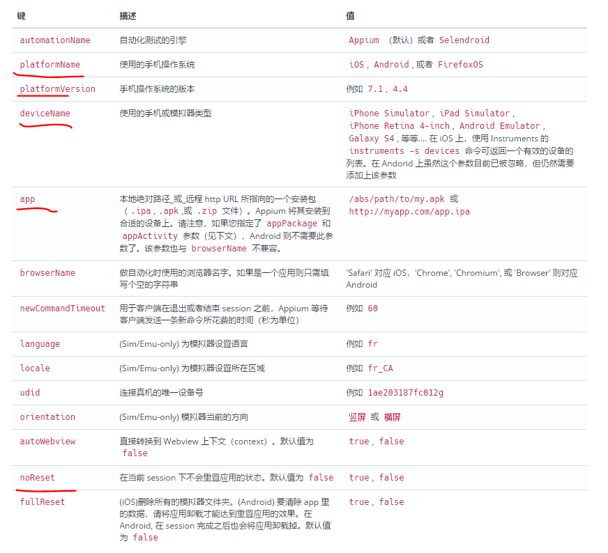
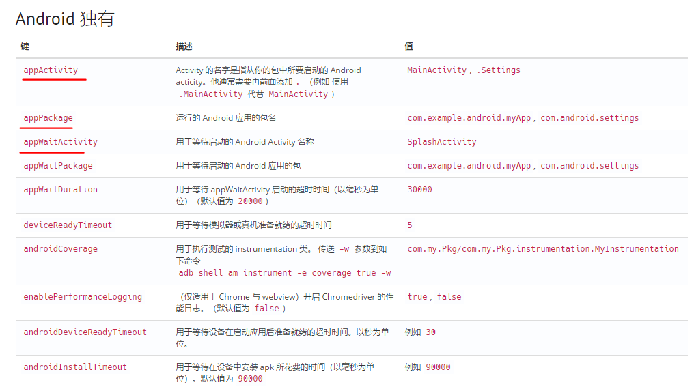
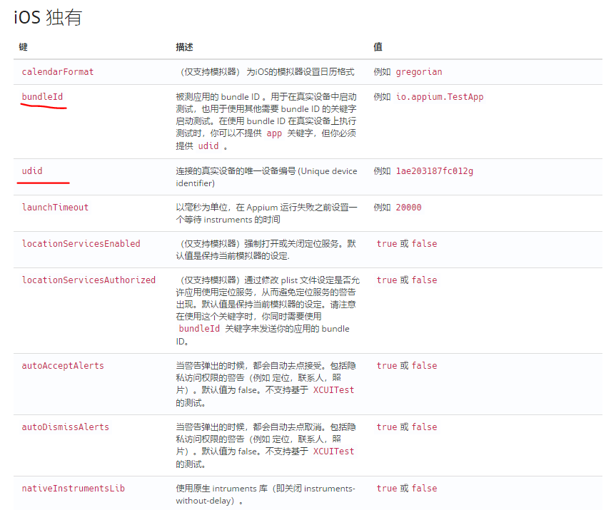
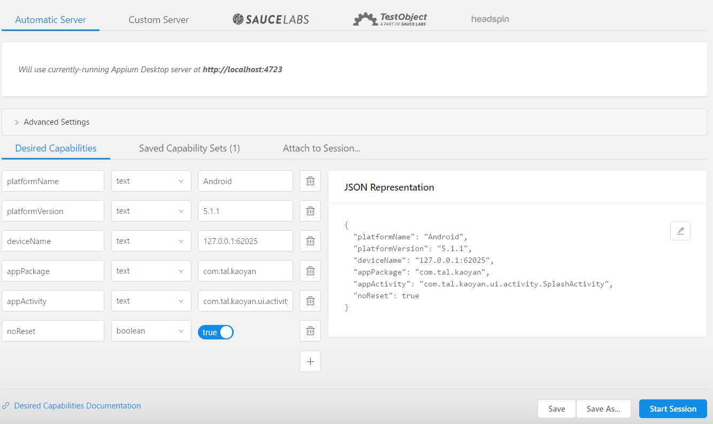
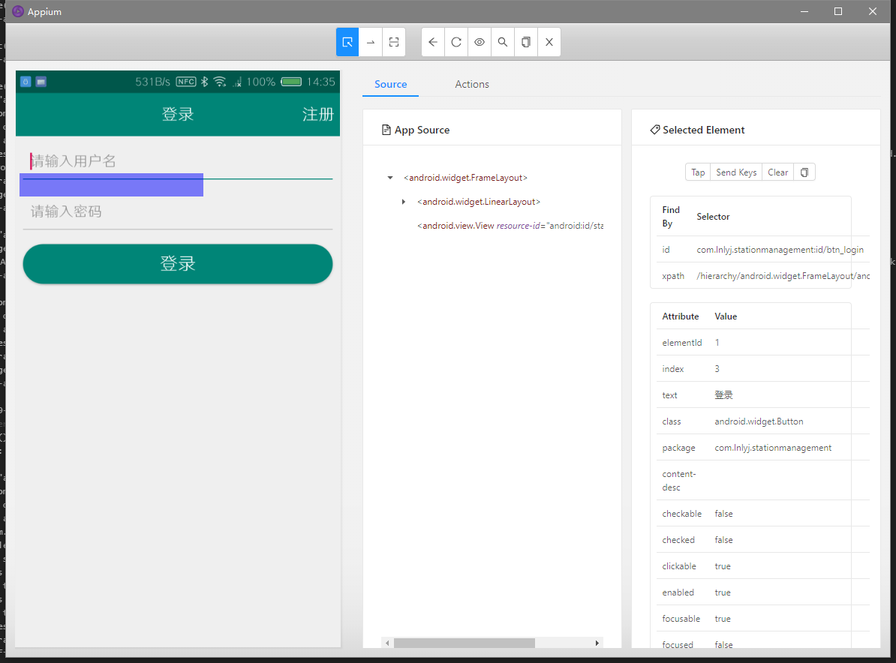

什么是Capability
==
Desired capability的功能是配置Appium会话。他们告诉Appium服务器您想要自动化的平台和应用程序。<br>
Desired Capabilities是一组设置的键值对的集合，其中键对应设置的名称，而值对应设置的值。（如："platformName": "Android"）Desired Capabilities主要用于通知Appium服务器建立需要的Session。<br>
**Session**<br>
Appium的客户端和服务端之间进行通信都必须在一个Session的上下文中进行。客户端在发起通信的时候首先会发送一个叫作“Desired Capabilities”的JSON对象给服务器。服务器收到该数据后，会创建一个session并将session的ID返回到客户端。之后客户端可以用该session的ID发送后续的命令。<br>
## 常用Capability配置讲解
[Capability官方完整文档](http://appium.io/docs/cn/writing-running-appium/caps/#android)<br>
如果有了解过Capability的人会发现一个问题，其实他主要分成了三部分：公共部分、ios部分、android部分,下面介绍一些公用常用的,红色标记的为常用的选项。<br>
### 公用Capability

Android独有Capability

ios独有Capability



## Capability启动App演示
### New Session Window 会话建立
•	Custom Server：例如，如果要针对运行在网络中另一台计算机上的Appium服务器启动Inspector会话，这很有用。<br>
•	Sauce Labs：如果您无法访问机器上的iOS模拟器，则可以利用Sauce Labs帐户在云中启动Appium会话。<br>
•	TestObject：您还可以利用TestObject的真实设备云来进行真机测试。<br>
•	headspin:使用远程设备来创建会话。<br>
### desired capability参数Josin
```capability参数Josin
{
  "platformName": "Android",
  "platformVersion": "5.1.1",
  "deviceName": "127.0.0.1:62025",
  "appPackage": "com.tal.kaoyan",
  "appActivity": "com.tal.kaoyan.ui.activity.SplashActivity",
  "noReset": true
}
 ```

新的会话窗口允许您构造一组desired capabilities，用于启动Appium会话。您可以针对当前运行的Appium Desktop服务器(默认的)启动一个会话，或者您可以针对各种其他端点启动一个会话。<br>
因为不需要使用Appium Desktop自己的服务器，您可以在不启动Appium Desktop服务器的情况下进入新的会话窗口。只需点击“File”(Windows / Linux)或“Appium”(Mac)，然后选择“New Session…”，它将打开新的会话窗口，而不必启动本地服务器。在这种情况下，将禁用附加到本地服务器。<br>
### Inspector元素获取
启动成功之后就可以使用 Inspector来进行元素空间获取了。

